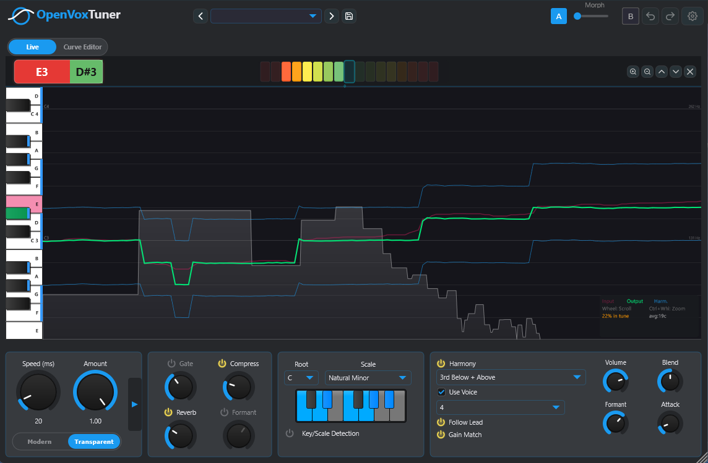
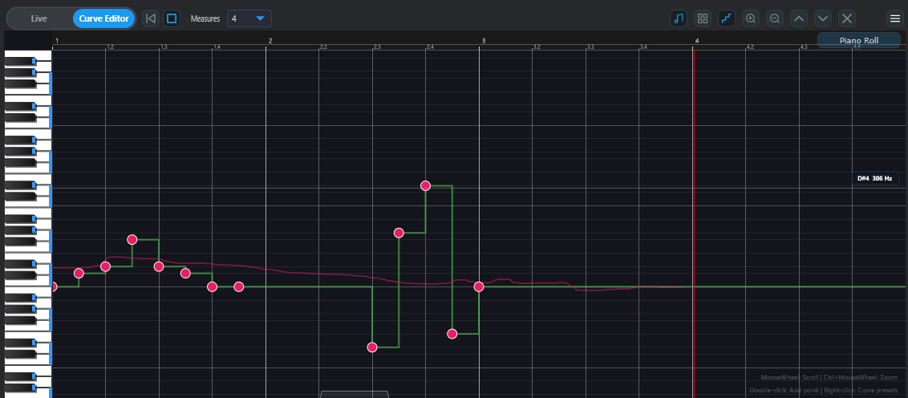
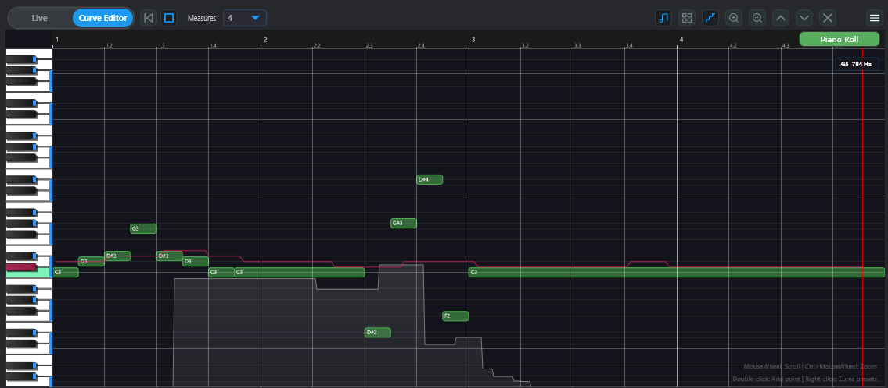
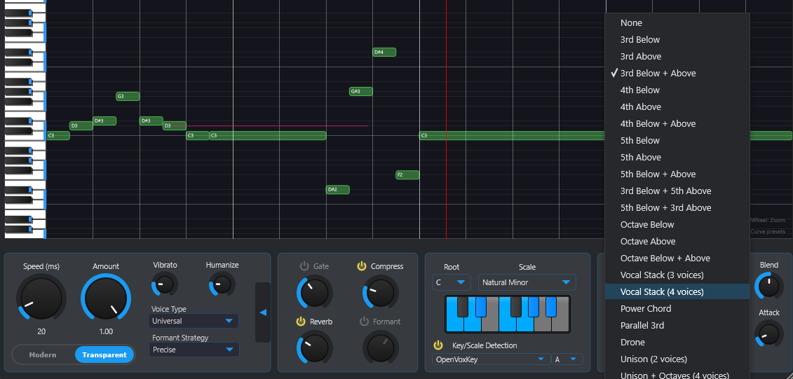

<p align="center">
  <a href="https://opensource.org/license/agpl-v3"></a>
  
  
  
  
</p>

<p align="center">
  
</p>

<h1 align="center">OpenVoxTuner</h1>

<h3 align="center">Echtzeit-Pitchkorrektur &amp; Harmonie-Generierung für Gesang</h3>

<p align="center">
  VST3 / AU / Standalone &mdash; gebaut mit JUCE 8 (C++17)
</p>

<p align="center">
  <a href="#funktionen">Funktionen</a> &bull;
  <a href="#screenshots">Screenshots</a> &bull;
  <a href="#lizenz">Lizenz</a> &bull;
  <a href="#build">Build</a> &bull;
  <a href="https://openvoxtuner.eiffelbs.ovh" target="_blank">Website</a> &bull;
  <a href="https://ovtdocs.eiffelbs.ovh" target="_blank">Docs</a>
</p>

<p align="center">
  <a href="../README.md">English</a> &mdash;
  <a href="README_fr_FR.md">Fran&ccedil;ais</a> &mdash;
  Deutsch &mdash;
  <a href="README_es_ES.md">Espa&ntilde;ol</a> &mdash;
  <a href="README_ja_JP.md">&#26085;&#26412;&#35486;</a> &mdash;
  <a href="README_zh_CN.md">&#20013;&#25991;</a>
</p>

## Inhaltsverzeichnis

[Screenshots](#screenshots) &bull;
[Funktionen](#funktionen) &bull;
[Warum OpenVoxTuner?](#warum-openvoxtuner) &bull;
[Repository-Struktur](#repository-struktur) &bull;
[Lizenz](#lizenz) &bull;
[Projekt unterstützen](#projekt-unterstützen) &bull;
[Entwickler-Lizenz](#entwickler-lizenz) &bull;
[Mitwirken](#mitwirken) &bull;
[Build](#build) &bull;
[Dokumentation](#dokumentation)

---

## Screenshots

<p align="center">
  
</p>

<details>
<summary><strong>Weitere Screenshots...</strong></summary>

<p align="center">
  
  
</p>
<p align="center">
  
</p>

</details>

## Funktionen

### Tonhöhenkorrektur

- **Auto-Modus** — Skalen-Quantisierung mit 14 Skalenarten (Dur, Moll, Pentatonisch, Blues, Dorisch, Phrygisch, Lydisch, Mixolydisch, Lokrisch, Chromatisch, Benutzerdefiniert...)
- **Grafischer Modus** — zeichnen Sie Ihre eigene Tonhöhenkurve (grafischer Editor mit Snap, Raster, Kopieren/Einfügen, Rückgängig/Wiederherstellen)
- **Korrekturmodus** — Modern (streng) oder Transparent (sanft)er Charakter
- **Speed & Amount** — Rückführungs-Hüllkurve und Trochen/Nass-Mischung für natürliches oder robotisches Ansprechverhalten
- **Humanize** — fügt subtile zufällige Variation für natürlicheren Klang hinzu (0–50 Cent)
- **Vibrato Preserve** — bewahrt das natürliche Vibrato des Sängers durch die Korrektur hindurch (0–100 %)
- **Stimmtyp** — begrenzt den Bereich der Tonhöhen-Erkennung (Universal, Bass, Bariton, Tenor, Alt, Sopran)
- **Latenzmodus** — Direct Monitoring, Low Latency, Quality, Safe

### Tonart-Erkennung

- **Auto** — Echtzeit-Tonarterkennung aus der Audioeingabe (Krumhansl-Schmuckler-Profile)
- **OpenVoxKey** — Begleit-Überbrückung über Shared-Memory-IPC
- **Sidechain** — Analyse des Begleitthroughs über eine dedizierte Sidechain-Bus

### Effekte

- **Formant-Verarbeitung** — 3 Modi (Legacy, MultiFormant, Allpass) mit mehreren Erhaltungsstrategien (LPC-Cross-Synthese verfügbar)
- **Hall** — integrierter Hall mit einstellbarem Mix
- **Noise Gate** — Eingangs-Gate mit Schwellenwertregelung (-80 bis 0 dB)
- **Upward Compressor** — hebt leise Passagen vor der Tonhöhen-Erkennung an

### Harmonie-Engine

- **Use Voice-Modus** — verschiebt Ihren Live-Gesang in 1–4 Harmoniestimmen mit Stereo-Panorama
- **Synth-Modus** — synthetisierte Harmonietöne (Choir, Organ) mit einstellbarer Klangfarbe
- **22 Harmonie-Typen** — Intervalle (Terz/Quarte/Quinte/Oktave unter/über), Vocal Stack, Power Chord, Drone, Unison...
- **Harmonie-Regler** — Gain Match (automatische RMS-Anpassung), Follow Lead, pro Stimme Attack, Harmony Formant Shift (-5 bis +5 Halbtonschritte)
- Harmonie-Spurüberlagerung im Kurven-Editor

### Kurven-Editor & Visualisierer

- Grafischer Tonhöhenkurven-Editor mit Punkt-Ziehen, Snap an Skala/Raster, Kopieren/Einfügen, Rückgängig/Wiederherstellen
- Echtzeit-Tonhöhen-Visualisierung mit Ein-/Ausgabe- und Harmonie-Spuren
- Klaviertastatur mit automatischer Notenhervorhebung
- Waveform-Überlagerung (Line, Mirror oder Spectral)
- Export als PNG (2x-Auflösung)

### ARA2-Integration

- ARA2-Support — liest Tonart, Skala und Taktart aus der DAW-Timeline
- Taktart-sensitiver Taktstrich-Lineal mit Auto-Scroll
- Multi-Taktart-Support (Taktartwechsel mitten im Projekt)
- Wellenform-Overlay, synchron zur DAW-Timeline

> ARA2 synchronisiert das Plugin mit der DAW-Timeline (Tonart/Skala, Taktart, Playhead, Wellenform). OpenVoxTuner bleibt ein **Echtzeit-Effekt** — es bietet keine Offline-Bearbeitung Note für Note wie dedizierte Pitch-Editoren.

### A/B-Vergleich & Morphing

- **A/B-Slots** — speichern und abrufen von zwei vollständigen Plugin-Zuständen
- **Morph-Regler** — kontinuierliche Interpolation zwischen A und B (alle Parameter weich überblendet)
- Zustand bleibt über Sessions erhalten

### Sonstiges

- MIDI-Notenausgabe (aus erkannter Tonhöhe generiert)
- MIDI-Ziel (eingehendes MIDI steuert die Korrektur-Tonhöhe)
- Kurven-Presets mit Karten-basierter Galerie-Ansicht
- Globaler Rückgängig/Wiederherstellen (alle automatisierbaren Parameter)
- Dunkles/Helles Theme
- Stereo-Verarbeitung, PSOLA-Pitch-Shifting mit niedriger Latenz
- Standalone-Modus mit internem 120-BPM-Transport

## Warum OpenVoxTuner?

- **Open Source by Design** — jede Zeile DSP, UI und Preset-Logik ist öffentlich. Keine Black Box, keine Telemetrie, keine Funktions-Paywalls. Sie können genau nachlesen, wie Ihre Stimme verarbeitet wird.
- **AGPLv3 für Freiheit** — die Lizenz garantiert, dass das Projekt frei und offen bleibt. Jeder darf es nutzen (sogar kommerziell), und Verbesserungen müssen mit der Community geteilt werden.
- **ARA2 nativ** — Tonart, Skala und Taktart werden direkt aus Ihrem DAW-Projekt gelesen, sodass das Plugin Ihrem Arrangement ohne manuelle Einrichtung folgt.
- **Für echten Gesang gebaut** — YIN-Pitch-Erkennung, formanterhaltendes PSOLA und ein grafischer Curve-Editor sind auf die Nuancen gesungener Performances abgestimmt, nicht nur auf Proof-of-Concept-Demos.

### KI-unterstützte Entwicklung

OpenVoxTuner nutzt KI-Coding-Assistenten, um die Entwicklung zu beschleunigen, stets unter strenger menschlicher Aufsicht. Jede Codezeile wird überprüft, getestet und vollständig für Community-Audits offengelegt. Es wird kein ungeprüfter KI-generierter Code gemergt.

## Repository-Struktur

```text
.
├─ Source/
│  ├─ dsp/                        # DSP-Module
│  │  ├─ IPitchDetector.h         # Abstrakte Pitch-Detektor-Schnittstelle
│  │  ├─ YinPitchDetector.*       # YIN-Algorithmus (aktiv)
│  │  ├─ ScaleQuantizer.*         # Skalen-Quantisierungs-Engine
│  │  ├─ PitchShifter.*           # PSOLA-Pitch-Shifter
│  │  ├─ RetargetEnvelope.*       # Speed-Hüllkurven-Glätter
│  │  ├─ FormantPreserver.*       # Formant-Kompensationsfilter
│  │  ├─ NoiseGate.h              # Eingangs-Noise-Gate (RMS-basiert, Hysterese)
│  │  ├─ PitchCurve.*             # Curve-Datenmodell
│  │  ├─ PresetMorpher.h          # A/B-Morphing-Engine
│  │  ├─ HarmonyEngine.*          # Harmonie-Synthese-Engine
│  │  ├─ PitchDetector.*          # Originale YIN-Referenz (nicht kompiliert)
│  │  └─ NoteUtils.h / IPitchShifter.h
│  ├─ ui/                         # UI-Komponenten
│  │  ├─ PitchCurveEditor.*       # Curve-Editor-Komponente
│  │  ├─ PitchVisualizer.*        # Pitch-Visualisierung
│  │  ├─ PianoKeyboard.*          # Klavier-Widget
│  │  ├─ ScaleKeyboardComponent.* # Skalen-Tastatur-Anzeige
│  │  ├─ LookAndFeel.*            # Eigener Look and Feel
│  │  ├─ OVTTheme.h               # Theme-Farben und gemeinsamer Waveform-Renderer
│  │  ├─ OVTFonts.h               # Font-Helfer
│  │  └─ OVTLanguages.h           # Mehrsprachige Übersetzungen
│  ├─ external/presonus/          # PreSonus-Plugin-Erweiterungen (Studio One)
│  ├─ resources/                  # Binäre Ressourcen (BuildInfo.h.in)
│  ├─ PluginProcessor.*           # Haupt-Audio-Prozessor
│  └─ PluginEditor.*              # Haupt-Editor-UI
├─ scripts/                       # Build- und Entwicklungsskripte
│  ├─ build.ps1                   # Windows-Build
│  ├─ build_installer.ps1         # Windows-Installer (Inno Setup)
│  ├─ build_macos_vst3.sh         # macOS VST3-Build
│  ├─ build_macos_au.sh           # macOS AU-Build
│  ├─ build_macos_pkg.sh          # macOS .pkg-Installer
│  ├─ build_macos.sh              # macOS Universal-Build
│  └─ ... (Installations-, Symlink-, Release-Helfer)
├─ test/                          # Unit-Tests (Catch2)
│  ├─ Main.cpp
│  └─ dsp/                        # Test-Suites pro Modul
├─ docs/                        # Dokumentation
│  ├─ releases/                   # Release-Notes (latest.json, v0.1.1.md)
│  ├─ architecture.md
│  ├─ default-parameters.md
│  └─ ...
├─ installer/                     # Windows-Installer-Ressourcen
│  └─ OpenVoxTuner.iss            # Inno-Setup-Skript
├─ .github/                       # CI/CD und Issue-Vorlagen
│  ├─ workflows/                  # GitHub Actions (CI, Release)
│  └─ ISSUE_TEMPLATE/             # Bug report / Feature request
├─ assets/                        # Binäre Ressourcen
│  └─ icon.png
├─ external/ARA_SDK/              # Celemony ARA SDK (v2.2, Submodule)
├─ CMakeLists.txt
├─ README.md
├─ LICENSE
├─ docs/implementation-roadmap.md
├─ .gitignore
├─ .gitattributes
└─ .gitmodules
```

## Lizenz

OpenVoxTuner ist **für alle kostenlos** unter der [AGPLv3](../LICENSE)-Lizenz — Musiker, Produzenten, Studios, Pädagogen. Keine Einschränkungen bei kommerzieller Nutzung.

### Drittanbieter-Lizenzen

| Bibliothek | Lizenz | Kompatibilität |
|---------|---------|--------------|
| JUCE 8 | AGPLv3 | Gleiche Lizenz |
| ARA SDK | Apache 2.0 | Voll kompatibel |
| PreSonus Extensions | Public Domain | Voll kompatibel |
| Catch2 (Tests) | Boost (BSL-1.0) | Voll kompatibel |

Alle Drittanbieter-Lizenzen sind mit AGPLv3 kompatibel.

### Was AGPLv3 für Sie bedeutet

| Sie sind... | Kostenlos? | Verpflichtung? |
|---|---|---|
| Musiker / Produzent | Ja | Keine — machen Sie einfach Musik |
| Studio (Mix, Master, Produktion) | Ja | Keine — Sie nutzen das Plugin als Werkzeug |
| Pädagoge / Student | Ja | Keine |
| Entwickler (modifiziert & redistribuiert) | Ja | Sie müssen Ihren modifizierten Quellcode unter AGPLv3 teilen |
| Firma (Fork in ein Closed-Source-Produkt) | Nein | Sie benötigen eine kommerzielle Lizenz |

> In der Praxis ist die AGPLv3-Lizenz, wenn Sie OpenVoxTuner zur Musikproduktion nutzen — selbst professionell — völlig kostenlos ohne Verpflichtungen.

### Projekt unterstützen

OpenVoxTuner ist für alle kostenlos. Wenn OpenVoxTuner Ihnen Zeit spart oder Ihre Musik unterstützt, erwägen Sie, das Projekt zu unterstützen — selbst eine kleine Spende macht einen riesigen Unterschied.

| Stufe | Plattform | Preis | Vorteile |
|------|----------|-------|----------|
| **Kostenlos** | — | 0 € | Volles Plugin, alle Funktionen |
| **Buy me a coffee** | [Ko-fi](https://ko-fi.com/) | Einmalig | Ein schnelles Dankeschön ❤️ |
| **Sponsor** | [GitHub Sponsors](https://github.com/sponsors/) | Monatlich | Unterstützung der laufenden Entwicklung |
| **Supporter** | Patreon | Bald verfügbar | Privater Discord + Abstimmung über kommende Features |
| **Gold** | Patreon | Bald verfügbar | Alle Supporter-Vorteile + Early Access / Beta-Builds + Name in Credits |

Jeder Beitrag hilft, das Projekt am Leben und frei für alle zu erhalten.

### Entwickler-Lizenz

Eine kommerzielle Lizenz ist für Entwickler oder Firmen verfügbar, die OpenVoxTuner in ein **Closed-Source-Produkt** integrieren möchten, ohne die AGPLv3-Copyleft-Verpflichtung.

**Was sie gewährt:**
- Erlaubnis, OpenVoxTuners DSP, UI-Komponenten und Algorithmen in proprietärer Software zu nutzen
- Keine Copyleft-Verpflichtung — Sie sind **nicht** verpflichtet, Ihren Quellcode zu veröffentlichen
- Keine Anforderung, Abwandlungen unter AGPLv3 zu veröffentlichen

**Was sie enthält:**
- Prioritärer E-Mail-Support
- Optionale Custom-Features und DSP-Beratung
- Perpetuelle Lizenz für die gekaufte Version (Updates je nach Stufe)

**Kontakt:** Issue auf GitHub öffnen.

## Mitwirken

Beiträge sind willkommen! Sie können helfen durch:

- Beheben von Bugs
- Verbesserung von DSP-Algorithmen
- Hinzufügen von Übersetzungen
- Verbesserung der UI
- Schreiben von Dokumentation
- Testen der DAW-Kompatibilität

Details siehe [CONTRIBUTING.md](../CONTRIBUTING.md).

### Review KI-generierten Codes

Einige Teile von OpenVoxTuner werden mit Hilfe von KI-Coding-Agenten geschrieben, stets unter menschlicher Aufsicht. Alle Codes werden vor dem Merge überprüft, und Community-Pull-Requests sind ausdrücklich erwünscht, um KI-assistierte Abschnitte zu auditieren, zu verbessern oder zu ersetzen.

## Build

### Windows (Visual Studio)

Voraussetzungen:
- Visual Studio 2022
- CMake >= 3.22
- JUCE 8 (Standardpfad in CMake: `C:/JUCE`)
- Git LFS (für binäre Ressourcen)

```powershell
# Debug-Build
.\scripts\build.ps1 -Configuration Debug

# Release-Build
.\scripts\build.ps1 -Configuration Release

# Windows-Installer bauen (benötigt Inno Setup)
.\scripts\build_installer.ps1
```

### macOS (VST3 / AU / pkg)

Voraussetzungen:

```bash
xcode-select --install
brew install cmake ninja
```

VST3 bauen:

```bash
./scripts/build_macos_vst3.sh --juce-path ~/dev/JUCE --install
```

AU bauen:

```bash
./scripts/build_macos_au.sh --juce-path ~/dev/JUCE --install
```

macOS `.pkg`-Installer bauen. Die offiziellen Releases liefern einen **signierten & notarisierten** Installer mit **VST3 + AU + Standalone**:

```bash
./scripts/build_macos_pkg.sh --juce-path ~/dev/JUCE --formats VST3,AU,STANDALONE
```

Um einen kleineren Installer ohne AU zu bauen, überschreiben Sie `--formats` (z. B. `VST3,STANDALONE`).

Detaillierte Build-Guides:
- [docs/MACOS_VST3_BUILD_GUIDE.md](../docs/MACOS_VST3_BUILD_GUIDE.md)
- [docs/MACOS_AU_AND_INSTALLER_GUIDE.md](../docs/MACOS_AU_AND_INSTALLER_GUIDE.md)

## Formate

| Format   | Windows | macOS |
|----------|---------|-------|
| VST3     | ✅      | ✅    |
| AU       | —       | ✅    |
| Standalone | ✅    | ✅    |
| ARA2     | ✅      | ✅    |

## Dokumentation

- [Website](https://openvoxtuner.eiffelbs.ovh) — Landing Page mit Funktionsübersicht und Download-Links
- [Online-Dokumentation](https://ovtdocs.eiffelbs.ovh) — vollständige Dokumentation (MkDocs Material)
- [docs/architecture.md](../docs/architecture.md) — Überblick über die Software-Architektur
- [docs/default-parameters.md](../docs/default-parameters.md) — Referenz aller Plugin-Parameter
- [docs/implementation-roadmap.md](../docs/implementation-roadmap.md) — Feature-Roadmap
- [docs/ARA_Specifications.md](../docs/ARA_Specifications.md) — Technische Spezifikationen des ARA2-Supports
- [docs/deployment-and-packaging-guide.md](../docs/deployment-and-packaging-guide.md) — Release-Workflow
- [docs/GITHUB_SETUP_AND_RELEASE.md](../docs/GITHUB_SETUP_AND_RELEASE.md) — GitHub-Repository-Einrichtung
- [docs/MACOS_VST3_BUILD_GUIDE.md](../docs/MACOS_VST3_BUILD_GUIDE.md) — macOS VST3-Build-Guide
- [docs/MACOS_AU_AND_INSTALLER_GUIDE.md](../docs/MACOS_AU_AND_INSTALLER_GUIDE.md) — macOS AU + Installer-Guide
- [docs/preset-morphing-technical-strategy.md](../docs/preset-morphing-technical-strategy.md) — A/B-Preset-Morphing-Strategie
- [docs/releases/v0.1.1.md](../docs/releases/v0.1.1.md) — Release-Notes

## Lizenz

Siehe [LICENSE](../LICENSE).

## Issue-Meldung

Verwenden Sie die GitHub-Issue-Vorlagen:
- [Bug report](../.github/ISSUE_TEMPLATE/bug_report.md)
- [Feature request](../.github/ISSUE_TEMPLATE/feature_request.md)

## Star-Historie

<a href="https://star-history.com/#EiffelBS/OpenVoxTuner&type=date">
  <picture>
    <source media="(prefers-color-scheme: dark)" srcset="https://api.star-history.com/svg?repos=EiffelBS/OpenVoxTuner&type=date&theme=dark" />
    <source media="(prefers-color-scheme: light)" srcset="https://api.star-history.com/svg?repos=EiffelBS/OpenVoxTuner&type=date" />
    
  </picture>
</a>
